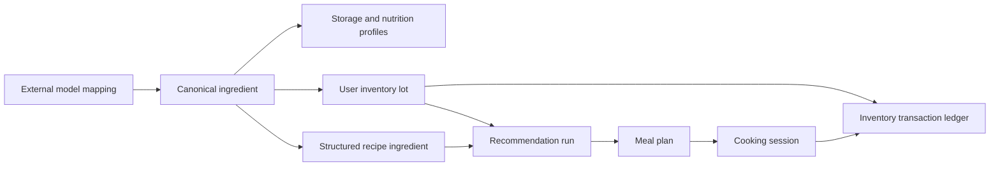

# Miiix Data Foundation

This directory is the source of truth for the target Supabase PostgreSQL schema.

## Three Concepts

- **Schema** defines the shape and relationships of data. It separates a shared ingredient definition such as `egg` from a user's specific purchase lot such as `six eggs bought today`.
- **Migration** is a numbered, append-only database upgrade. Every environment applies the same files in order, so a schema change is reviewable and reversible through a follow-up migration.
- **Repository** is the TypeScript contract used by the product. React features ask repositories for ingredients, inventory, recipes, and plans without knowing whether the data comes from memory, IndexedDB, or Supabase.

## Migration Order

1. `0001_catalog_foundation.sql`: canonical ingredients, aliases, categories, storage profiles, nutrition, assets, tools, and structured recipes.
2. `0002_user_operations.sql`: recognition review, inventory lots and transactions, favorites, plans, shopping lists, and cooking sessions.
3. `0003_recommendation_intelligence.sql`: Epicure mappings, versioned embeddings, recommendation runs, scoring evidence, and feedback.
4. `0004_row_level_security.sql`: public catalog read rules and owner-only access to private user data.
5. `0005_repository_adapter_support.sql`: portable recipe/plan metadata and cooking-session idempotency required by local and cloud adapters.

Do not edit an applied migration. Add `0006_description.sql` for the next change.

Inventory balance changes use `apply_inventory_transaction(...)`. It locks the lot, prevents negative balances, writes the ledger and balance atomically, and requires an idempotency key so a retried completion cannot deduct twice.

## Data Boundaries



## Deployment Target

The SQL targets Supabase PostgreSQL and assumes:

- Supabase Auth provides `auth.users`.
- Supabase Storage will hold ingredient cutouts, recognition uploads, and cooking photos.
- The `vector` extension is available for Epicure or future embedding models.
- AI provider secrets remain in an Edge Function or backend service, never in the GitHub Pages frontend.

The schema is defined but has not yet been deployed to a live Supabase project. v0.4.1 uses the IndexedDB adapter in `src/data/repositories/indexeddb/` to exercise the same Repository contracts locally. Credentials and a production project are intentionally outside this version.

## Validation

```bash
pnpm run check:migrations
pnpm run test
pnpm run build
```
