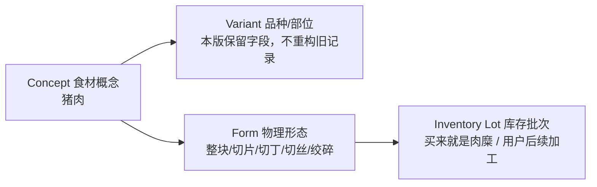

# Miiix v0.4.2.1 数据源接入与形态模型

> 产品版本：v0.4.2.1
>
> `package.json`：`0.4.2+patch.1`（四段产品版本映射为合法 SemVer）
>
> Catalog Schema：`1.1.0`

## 1. 这个补丁解决什么

v0.4.2 已有 30 条可校验黄金数据，但仍有两个结构性缺口：

1. 外部来源只是登记，没有固定修订、导入批次和可重放构建；
2. “猪肉”和“猪肉末”被当成两个平级食材，无法表达“同一食材概念、不同物理形态”。

v0.4.2.1 只闭合这两个缺口。它不扩到 200 项，不导入菜谱语料，不实现搭配排序，不接 OCR/VLM/LLM，也不改变 v0.4.3 的部署职责。

## 2. 四层身份模型



字段含义：

| 字段 | 回答的问题 | v0.4.2.1 规则 |
|---|---|---|
| `recordRole` | 目录记录代表概念、变体还是形态投影 | `concept / variant / form_projection` |
| `conceptId` | 它最终属于哪种基础食材 | 概念记录自指；猪肉末指向广义猪肉 |
| `variantId` | 是否指定品种或部位 | 本版保留为可空字段，不借机重构鸡肉部位等 30 条旧 ID |
| `formCode` | 当前物理形态 | `unspecified / whole_piece / sliced / diced / shredded / ground` |
| `processState` | 生熟或加工状态 | `unspecified / raw / cooked / processed` |
| `originType` | 库存形态从哪里来 | `purchased / user_transformed / imported / unknown` |
| `derivedFromLotId` | 是否由另一批库存加工而来 | 本版建字段；原子加工工作流未实现前禁止创建派生批次 |

“买来就是猪肉糜”应直接记录为：

```text
ingredientId = 猪肉末记录
conceptId = 猪肉
formCode = ground
processState = raw
originType = purchased
derivedFromLotId = null
```

用户把整块猪肉绞碎属于库存转换：必须同时扣减来源批次、建立派生批次并保存谱系。当前 `createLot` 会写采购流水，不能假装完成转换事务，因此 v0.4.2.1 明确拒绝 `user_transformed`；后续只能通过单独的原子用例开放。

## 3. `pork` 的兼容边界

旧版的 `pork` 不是自然语言，而是 v0.4.1 的技术 ID，当时实际业务内容是“肉沫”。因此：

- `resolveLegacyIngredientId("pork", "miiix-v0.4.1")` 继续迁移到“猪肉末”，避免篡改旧库存和旧菜谱；
- 普通英文 `pork` 解析到“猪肉（部位未指定）”；
- `ground pork / minced pork / pork mince / 猪肉糜 / 猪绞肉` 才解析到 `ground` 形态；
- `肉末 / 肉糜 / 肉沫` 缺少动物来源，保持 `pending`，不能自动窄化为猪肉；
- legacy ID 不进入普通搜索、OCR、LLM 或外部模型适配器。

## 4. 数据源接入合同

数据源不再只是一个 URL。发布所需最小链路为：

```text
Source manifest -> pinned mapping records -> ImportBatch -> deterministic builder
-> schema/semantic validation -> IndexedDB Catalog seed
```

关键治理字段包括：

- 来源修订 `sourceRevision`；
- 许可证代码与链接；
- 允许用途 `usageScopes`；
- 权利复核与再发布状态；
- importer 版本；
- 标准化 records 的 SHA-256；
- 导入、审核、接受/待审/拒绝计数；
- mapping 的层级、用途、信息损失、置信度和审核状态。

构建输入固定在 `src/data/catalog/imports/`，构建脚本不联网。相同 base、input 和 importer 必须生成字节一致的目录；checksum 不一致时必须失败，不能用同一 revision 静默覆盖。

## 5. Epicure 接入边界

本版接入的是固定修订 `03edd31` 的 Epicure vocabulary 对齐，不是完整推荐能力：

- 只保存 30 条黄金集与 Epicure token 的显式映射；
- 不复制底层菜谱正文；
- 不接运行时网络或模型 API；
- 不把模型 artifact 的 CC BY 4.0 推断成底层异构菜谱语料全部可再发布；
- `rightsReviewStatus=review_required`，只开放 identity 与 recommendation 实验用途；
- 有 lossiness 或非 exact 的映射保持 `pending`；
- Epicure 没有 `ground_pork` token，猪肉末通过 `conceptId` 继承 `pork:1264`，查询结果显式增加 `form` lossiness。

这使后续共现/搭配实验能对齐稳定 Miiix ID，但本版本不宣称已经拥有菜谱共现边、可用菜谱库或可上线推荐质量。

## 6. 三种存储的一致性

- JSON Catalog 保存审核后的发布快照和导入证据；
- IndexedDB v3 增加 source batch、form definition、concept/form 索引，并在同一 seed 事务中回填旧库存、菜谱行、购物项和识别候选的 spec；
- PostgreSQL 只通过追加的 `0007_ingredient_identity_layers.sql` 增加同义字段、约束、索引和 RLS，不修改 `0001`–`0006`。

Inventory Lot 仍保留 `ingredientId` 作为可选择目录记录，同时保存 `conceptId + variantId + formCode + processState`。这样界面能显示“猪肉末”，匹配与推荐又能回到“猪肉”概念，不需要二选一。

一致性规则：

- seed 兼容迁移只处理受控的 Miiix 引用字段，不按字段名后缀递归修改外部 provider/token ID；
- 目录更新只补旧记录缺失的 spec，用户已保存的 `diced/ground` 等形态不会被 catalog 默认值覆盖；
- 未解析 recognition candidate 仍会回填 `null/null/unspecified/unspecified`，使旧记录满足新合同；
- recognition correction 与 concept/variant/form/process 在同一事务更新；
- 业务 mapping 查询只返回 approved，并且 concept mapping 必须声明可向 form projection 继承；
- 广义 concept 要求允许同 concept 的具体形态满足，明确 ground 要求不会把 unspecified 批次误判为已满足。

## 7. 本版不做

- Epicure embedding/NPMI 图导入和线上相似度服务；
- 菜谱正文、步骤和授权清洗；
- 基于三样食材的惊喜度/合理性排序；
- 200 项扩库；
- 用户加工批次的扣减/产出事务；
- 生产图片和 AI 生图风格；
- Supabase 部署、同步或前端模型 Key。

下一数据门槛必须单独定义“菜谱共现/搭配关系”的来源权利、关系语义、离线评测和失败回退，不能用几个 token 映射冒充推荐系统已经完成。
