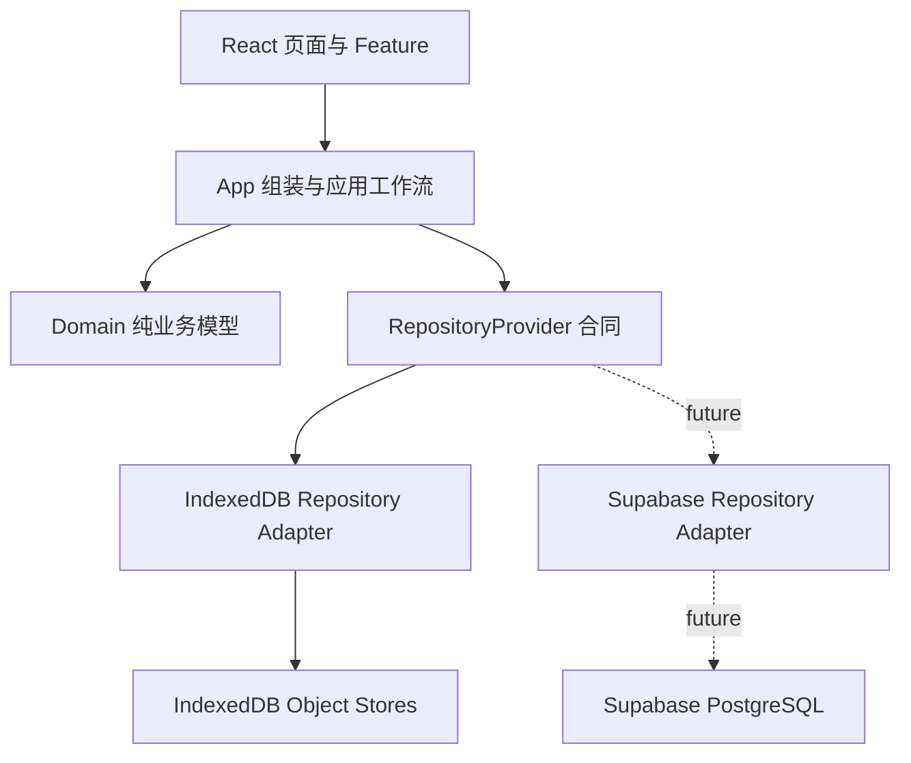

# Miiix v0.4.1 项目交接文档

文档状态：Release handoff
版本：`v0.4.1 持久化纵向链路`
收尾日期：2026-07-17
代码仓库：`/Users/hannah/Documents/Codex/2026-06-22/vibe-coding-ai-20-ai-rag`
GitHub：<https://github.com/HannahHan1625/Miiix>
Obsidian：`/Users/hannah/Documents/个人产品/Miiix融合器`
本地地址：<http://127.0.0.1:5173/>

---

## 1. 交接结论

Miiix 已从“刷新即丢失的 React 演示原型”推进到“浏览器本地数据可持久化的产品原型”。v0.4.1 已跑通以下纵向闭环：

```text
新增库存
-> 写入库存批次与采购流水
-> 选择具体库存批次
-> 融合生成候选菜谱
-> 保存今日计划与购物清单
-> 完成制作
-> 写制作会话
-> 扣减库存并写消耗流水
-> 完成计划
-> 生成日记投影
-> 刷新后恢复全部状态
```

该闭环已经通过自动化集成测试、生产构建、数据库迁移检查和 390px 移动端浏览器验收。

> 严格边界：v0.4.1 完成的是 IndexedDB 本地持久化，不是云数据库上线。当前没有用户账号、跨设备同步、云端备份、真实 OCR/VLM 或真实 AI 推荐服务。

---

## 2. 当前产品定位

Miiix 的本质保持不变：

> 面向有做饭习惯的独居者和小家庭，以库存记录和基于库存的菜谱生成，减少食材浪费与“今天吃什么”的决策成本。

核心闭环只有四类业务事实：

1. 家里现在有什么食材。
2. 可以基于这些食材做什么。
3. 用户决定今天做什么。
4. 做完后实际消耗了什么，下一次需要买什么。

创新菜式、浙江口味、跨菜系尝试、图片识别、语音反推和 Epicure 推荐都属于增强能力，不能改变产品本质。

完整产品要求见：

- [`docs/product/miiix-prd-v0.4.1.md`](../product/miiix-prd-v0.4.1.md)
- Obsidian：`10 产品与用户/14 Miiix PRD v0.4.1.md`

---

## 3. 版本状态

### 3.1 已完成

- React + Vite + TypeScript 移动端 Web MVP。
- 四项主导航：主页、仓库、菜谱、日记。
- 统一食材上传入口与四种录入方式的交互原型。
- 食材分类、默认储存、数量、价格、新鲜度和备注原型。
- 仓库融合工作台：食材、厨具、偏好、融合。
- 推荐菜弹窗、收藏、看做法、再融合、今天做。
- 候选菜谱、收藏、今日计划、制作完成、日记的生命周期拆分。
- 目标 Supabase PostgreSQL Schema 和 5 个有序 Migration。
- TypeScript Repository 合同。
- IndexedDB Repository Adapter。
- 应用工作流服务。
- 库存批次、采购流水、消耗流水、菜谱、收藏、今日计划、购物清单、制作会话和日记持久化。
- 制作完成与库存扣减的原子事务。
- 制作与库存消耗的幂等控制。
- UTC 时间戳与用户本地业务日期分离。
- fake IndexedDB 纵向集成测试。
- 版本文档与 Obsidian 知识图谱更新。

### 3.2 尚未完成

- Supabase 项目部署与 Supabase Repository Adapter。
- 注册、登录、用户身份与跨设备同步。
- IndexedDB 数据重置、升级失败恢复和备份入口。
- 首批 200 个高频食材主数据。
- 正式授权食材、厨具和菜谱图片资产库。
- 真实小票 OCR、购物截图识别、食材视觉识别。
- 真实菜品图片或语音反推菜谱。
- Epicure 模型与 Miiix 食材 ID 的正式映射和推荐 Adapter。
- 服务端 API、模型密钥管理和调用成本控制。
- GitHub Pages 正式部署流水线。
- 用户分析事件的真实采集与指标看板。
- iOS 原生产品化、TestFlight 和 App Store 发布。

### 3.3 当前版本不得误判

| 容易产生的误判 | 正确结论 |
|---|---|
| 页面出现“AI 已识别”就是接入了 AI | 目前仍是本地预设模拟识别 |
| 融合能生成菜名就是接入了大模型 | 目前是前端确定性组合逻辑 |
| 刷新不丢数据就是云数据库完成 | 目前只保存在当前浏览器 IndexedDB |
| Repository 合同存在就是 Supabase 可用 | Supabase Adapter 尚未实现 |
| 有食材图片就是资产库完成 | 当前图片数量、匹配、授权和审核都未达标 |
| 有日历就是偏好学习完成 | 当前只显示行为账本，尚未建立可训练偏好模型 |
| 已扣库存就是精确用量 | 当前采用临时规则：主料每批最多 125g 或 1 件 |

---

## 4. 技术栈

| 层级 | 当前选择 | 说明 |
|---|---|---|
| UI | React 19 | 现有移动端产品页面 |
| 语言 | TypeScript 5.7 | 领域模型、Repository 合同与页面 |
| 构建 | Vite 6 | 本地开发与生产构建 |
| 图标 | lucide-react | 统一按钮与导航图标 |
| 本地持久化 | IndexedDB + `idb` | GitHub Pages 验证期的数据载体 |
| 自动化测试 | Vitest + fake-indexeddb | 无网络纵向持久化测试 |
| 目标云数据库 | Supabase PostgreSQL | 尚未部署和接入 |
| iOS 壳 | Capacitor | 保留但当前暂停 |

当前不需要：

- Vue 迁移。
- ECS 架构。
- Three.js。
- PocketJS runtime 迁移。
- 重型全局状态框架。
- 传统 MVC 套壳。

理由不是这些技术不好，而是当前瓶颈是数据质量、真实识别、云端同步和产品验证，不是渲染性能。

---

## 5. 系统架构

### 5.1 总体依赖方向



必须遵守的依赖规则：

1. Feature 和 Domain 不得导入 IndexedDB、Supabase 或 SQL。
2. 应用工作流依赖 `RepositoryProvider`，不依赖具体 Adapter。
3. `App.tsx` 是 Composition Root，可以选择 `createIndexedDbRepositoryProvider()`。
4. Adapter 可以依赖具体数据库 API。
5. 数据库 Schema 变化必须新增 Migration，不能修改已部署 Migration。

### 5.2 分层职责

| 层 | 路径 | 职责 | 禁止事项 |
|---|---|---|---|
| Composition | `src/App.tsx` | 创建 Provider、管理页面级状态、连接用户动作 | 不写 object store/SQL 逻辑 |
| Application | `src/application/` | 编排新增库存、计划、完成制作等用例 | 不依赖具体 IndexedDB ID |
| Domain | `src/domain/` | 类型、纯规则、日期、购物缺口、新鲜度 | 不访问数据库和浏览器 API |
| Repository Contract | `src/data/repositories/contracts.ts` | 定义产品可用的数据操作 | 不出现具体表名或 IDB store 名 |
| IndexedDB Adapter | `src/data/repositories/indexeddb/` | 将合同翻译为 IDB 事务与索引操作 | 不承载页面逻辑 |
| Catalog Seed | `src/data/catalog.ts` | 当前小规模演示目录 | 不视为正式 200 食材数据源 |
| PostgreSQL Schema | `database/migrations/` | 目标云端数据结构和权限 | 不覆盖已应用迁移 |

### 5.3 Repository、Adapter、Provider

Repository 是业务操作合同，例如：

```ts
inventory.createLot(...)
inventory.appendTransaction(...)
planning.createMealPlan(...)
cooking.completeSession(...)
```

Adapter 是合同的具体实现。当前实现将这些操作翻译成 IndexedDB 请求；未来 Supabase Adapter 应将同样操作翻译成 PostgreSQL RPC、SQL/API 与 RLS 约束。

Provider 负责组装所有 Repository，并提供统一事务：

```ts
provider.repositories.inventory
provider.repositories.recipes
provider.repositories.planning
provider.repositories.cooking
provider.transaction(...)
```

v0.4.1 收尾时修复了一处隐性耦合：应用服务不再直接使用 IndexedDB Adapter 中的 `LOCAL_UNIT_IDS`。它改为通过 `CatalogRepository` 按语义解析 `piece`、`g`、`refrigerated`、`frozen` 等目录引用。因此未来 Supabase 返回 UUID 时，业务服务不需要修改。

---

## 6. 领域模型

### 6.1 当前 UI 模型

| 模块 | 主要对象 | 当前作用 |
|---|---|---|
| `domain/inventory.ts` | `FoodInfo`, `InventoryItem`, `RecognizedFood` | 食材目录投影、库存展示、识别确认 |
| `domain/recipe.ts` | `Recipe`, `KitchenTool`, `FoodPreference` | 菜谱卡、厨具、偏好与融合结果 |
| `domain/plan.ts` | `MealPlan`, `ShoppingLine` | 今日计划与采购缺口 |
| `domain/diary.ts` | `DiaryEntry`, `ConsumedInventoryItem` | 日历账本与制作消耗投影 |
| `domain/persistence.ts` | 持久化记录类型 | Repository 与 Adapter 的共同数据契约 |

### 6.2 持久化核心对象

| 对象 | 业务含义 | 关键关系 |
|---|---|---|
| `CanonicalIngredient` | 公共标准食材 | 被库存、菜谱、识别引用 |
| `InventoryLot` | 一次实际采购批次 | 拥有初始量、余额、储存、过期时间 |
| `InventoryTransaction` | 采购、消耗、浪费、调整流水 | 引用具体批次，可引用制作会话 |
| `RecipeDocument` | 稳定菜谱文档 | 拥有用料、步骤和厨具 |
| `MealPlanRecord` | 某日计划 | 引用菜谱，保存状态和元数据 |
| `ShoppingListRecord` | 计划产生的采购清单 | 拥有缺口条目 |
| `CookingSessionRecord` | 一次实际制作 | 完成后形成日记并触发消耗 |
| `RecognitionJob` | 一次识别任务 | 保存输入、模型版本、候选和纠错 |
| `RecommendationRun` | 一次推荐运行 | 保存输入快照、候选、分数和反馈 |

### 6.3 当前映射限制

UI 仍然使用 `recipe.required: string[]`。保存时会根据中文名称查找本地 `foodLibrary` 并转为食材 ID。目录中不存在的“盐、少量糖、清水”等项只保留在 recipe metadata，不能形成完整结构化用料行。

这不是可长期接受的方案。v0.4.2 必须建立标准食材 ID、别名解析和完整调味品目录，逐步减少字符串名称映射。

---

## 7. IndexedDB 数据结构

数据库名：`miiix-local`
数据库版本：`1`

| Object Store | 内容 | 主要索引 |
|---|---|---|
| `meta` | 本地种子版本等元信息 | 主键 `key` |
| `inventoryLots` | 用户库存批次 | user/status、user/ingredient |
| `inventoryTransactions` | 采购与消耗流水 | user、lot、user/idempotency |
| `recipes` | 菜谱文档 | status |
| `recipeIngredients` | 菜谱结构化用料 | recipe |
| `recipeSteps` | 菜谱步骤 | recipe |
| `recipeTools` | 菜谱厨具关系 | recipe |
| `favorites` | 收藏关系 | user |
| `mealPlans` | 今日计划 | user、user/date |
| `shoppingLists` | 购物清单 | user、meal plan |
| `shoppingItems` | 购物条目 | list |
| `cookingSessions` | 制作会话 | user、user/idempotency |
| `recognitionJobs` | 识别任务 | user |
| `recognitionCandidates` | 识别候选 | job |
| `recommendationRuns` | 推荐运行 | user |
| `recommendationCandidates` | 推荐候选 | run |
| `recommendationFeedback` | 推荐反馈 | user、run |

当前本地种子版本为 `SEED_VERSION = 1`。首次打开会写入演示库存、菜谱、收藏和一条历史制作记录。种子完成后写入 `meta`，后续刷新不重复初始化。

注意：当前浏览器配置中留有手工冒烟验收数据，例如鸡翅库存 500g 制作后剩余 375g，以及对应日记。这是当前浏览器的本地数据，不属于代码种子，也不会被提交到 Git。

---

## 8. 持久化纵向链路

### 8.1 新增库存

入口：主页“上传食材”。

步骤：

1. 用户选择拍照、线上截图、小票或手动输入。
2. 当前版本生成模拟识别候选或使用手动分类。
3. 用户修改食材、储存、数量、价格和备注。
4. `addInventoryItems()` 调用 Inventory Repository。
5. Adapter 在一个事务中新增 `InventoryLot` 和 `purchase` 流水。
6. 应用重新读取可用库存并更新页面。

失败原则：库存批次与采购流水必须同时成功，否则都不写入。

### 8.2 保存今日菜单

入口：融合推荐卡或菜谱卡的“今天做”。

步骤：

1. 保存生成菜谱。
2. 取消当天已有未完成计划。
3. 新建 `MealPlanRecord`。
4. 保存用户明确选择的库存批次 ID。
5. 计算购物缺口并创建 Shopping List。
6. 跳转日记页面，显示今日计划卡。

注意：计划不等于制作完成，不能写入做过记录，也不能扣库存。

### 8.3 完成制作

入口：日记页面今日计划卡的“完成制作”。

事务中的顺序：

```text
保存菜谱
-> 以 meal-plan:{planId} 创建或恢复制作会话
-> 读取可用库存批次
-> 匹配用户选择的批次
-> 以 cook:{sessionId}:{lotId} 写 consume 流水
-> 更新批次余额与状态
-> 完成制作会话并保存消耗投影
-> 将 Meal Plan 标记为 completed
```

任何一步失败，整个事务回滚。

### 8.4 幂等

幂等意味着同一个业务请求执行一次或重试多次，最终结果一致。

- 制作会话幂等键：`meal-plan:{planId}`。
- 库存流水幂等键：`cook:{sessionId}:{lotId}`。
- IndexedDB 对 `userId + idempotencyKey` 建唯一索引。
- 第二次完成相同计划会返回已有 completed session，不再扣库存。

### 8.5 当前扣减规则

当前不是精确菜谱克重扣减：

- 重量主料：每个选中批次最多扣 125g。
- 件数主料：每个选中批次最多扣 1 件。
- 调味类：重量最多 10g，件数最多 0.1。
- 不允许扣成负数。

该规则仅用于验证数据闭环。v0.4.2 之后应由结构化菜谱用量、份数、单位换算和用户确认共同决定实际扣减。

---

## 9. 时间与日期

- 数据库保存完整 ISO UTC 时间戳，便于排序与跨时区一致性。
- 日记同时保存 `completedDateISO` 作为用户本地业务日期。
- 恢复日记时优先使用 `completedDateISO`。
- 旧记录缺失该字段时，使用 `toISODate(new Date(timestamp))` 转成本地日期。

该设计修复了中国时区凌晨完成制作却因为直接截取 UTC 字符串而进入前一天的问题。

---

## 10. PostgreSQL Migration

| Migration | 作用 |
|---|---|
| `0001_catalog_foundation.sql` | 食材、别名、分类、储存、营养、图片、厨具、菜谱 |
| `0002_user_operations.sql` | 识别、库存、流水、收藏、计划、购物、制作 |
| `0003_recommendation_intelligence.sql` | 外部映射、Embedding、推荐运行、候选、反馈 |
| `0004_row_level_security.sql` | 公共目录读取与用户私人数据 RLS |
| `0005_repository_adapter_support.sql` | Recipe/Plan metadata 与制作幂等字段 |

规则：

- 已应用 Migration 不回头修改。
- 下一次 Schema 变化从 `0006_*.sql` 开始。
- 每个 Migration 必须包含版本头、`BEGIN;` 和 `COMMIT;`。
- `pnpm run check:migrations` 必须通过。

---

## 11. 关键文件

### 11.1 启动与编排

| 文件 | 作用 | 交接注意 |
|---|---|---|
| `src/main.tsx` | React 启动 | 当前启用 StrictMode |
| `src/App.tsx` | Composition Root 与页面状态 | 允许选择具体 Provider，不得写 IDB 操作 |
| `src/app/types.ts` | 页面导航类型 | 四个主导航视图 |

### 11.2 应用与领域

| 文件 | 作用 | 交接注意 |
|---|---|---|
| `src/application/kitchenPersistence.ts` | 全部持久化用例与 UI/记录映射 | 已依赖抽象 Provider；约 580 行，后续可按 use case 拆分 |
| `src/application/kitchenPersistence.test.ts` | 纵向集成测试 | 使用独立随机数据库，不污染正式本地 DB |
| `src/domain/inventory.ts` | 库存与新鲜度 | UI 模型仍混合 FoodInfo 投影 |
| `src/domain/recipe.ts` | 菜谱与厨具偏好 | `required` 仍为字符串数组 |
| `src/domain/plan.ts` | 今日计划与购物缺口 | 当前按食材名称判断拥有，未比较数量 |
| `src/domain/diary.ts` | 日历与制作投影 | 已支持 consumed 明细 |
| `src/domain/persistence.ts` | 数据契约 | 是 Repository 和 Adapter 的共同语言 |

### 11.3 Repository

| 文件 | 作用 | 交接注意 |
|---|---|---|
| `src/data/repositories/contracts.ts` | 稳定业务接口 | Supabase Adapter 必须实现这些接口 |
| `src/data/repositories/indexeddb/schema.ts` | IDB stores、索引、版本 | 当前版本 1，无 upgrade 测试 |
| `src/data/repositories/indexeddb/context.ts` | 事务上下文与 ID | bound transaction 用于跨 Repository 原子写入 |
| `src/data/repositories/indexeddb/catalogRepository.ts` | 当前本地 Catalog 实现 | 只覆盖小型演示目录 |
| `src/data/repositories/indexeddb/operationalRepositories.ts` | 六类业务 Repository 实现 | 约 568 行，云接入前可按领域拆文件 |
| `src/data/repositories/indexeddb/provider.ts` | Repository 组装与事务 | 当前事务打开全部 store，正确但粒度偏大 |

### 11.4 页面

| 路径 | 能力 |
|---|---|
| `src/features/home/HomeView.tsx` | 用户概览、上传入口、最近食材 |
| `src/features/inventory/UploadSheet.tsx` | 四种录入方式与人工校正 |
| `src/features/fusion/WarehouseView.tsx` | 食材、厨具、偏好、融合与推荐卡 |
| `src/features/recipes/RecipesView.tsx` | 菜谱库、筛选、模拟反推做法 |
| `src/features/diary/DiaryView.tsx` | 今日计划、完成制作、日历账本 |

### 11.5 文档

| 文件 | 作用 |
|---|---|
| `README.md` | 项目启动与当前版本摘要 |
| `database/README.md` | Schema、Migration、Repository 的非技术解释 |
| `outputs/version-history.md` | 代码仓库版本总账 |
| `outputs/v0.4.1-repository-adapter-self-check.md` | v0.4.1 验收证据 |
| `docs/product/miiix-prd-v0.4.1.md` | 当前完整 PRD |
| `docs/handoff/v0.4.2-session-prompt.md` | 新会话可直接使用的 Prompt |

---

## 12. 验证记录

### 12.1 自动化

```bash
pnpm run test
```

结果：

- Test Files：1 passed。
- Tests：1 passed。
- 覆盖新增库存、关闭重开、计划、完成制作、扣减、重复完成、防二次扣减和再次恢复。

```bash
pnpm run build
```

结果：

- TypeScript 通过。
- Vite 生产构建通过。
- 1598 modules transformed。

```bash
pnpm run check:migrations
```

结果：5 个 Migration 连续、版本头完整、事务边界完整。

```bash
git diff --check
```

结果：通过，无空白错误。

### 12.2 浏览器

视口：390 x 844。

结果：

- 页面宽度、HTML scrollWidth、body scrollWidth 均为 390px。
- 无横向溢出。
- IndexedDB 初始化成功。
- 刷新后显示“数据已保存在此设备”。
- 手工链路中鸡翅从 500g 扣减为 375g。
- 刷新后 375g 和日记记录仍存在。
- 控制台 error：0。

### 12.3 运行地址

```text
http://127.0.0.1:5173/
```

检查：

```bash
curl -I http://127.0.0.1:5173/
```

---

## 13. 本地运行

正常环境：

```bash
cd /Users/hannah/Documents/Codex/2026-06-22/vibe-coding-ai-20-ai-rag
pnpm install
pnpm run dev
```

验证：

```bash
pnpm run test
pnpm run check:migrations
pnpm run build
```

如果终端找不到 Node/pnpm，可使用 Codex bundled runtime；不要因此修改 package scripts 或提交环境绝对路径。

---

## 14. 已知缺陷与技术债

### P0：进入真实用户验证前必须处理

1. 没有正式食材主数据，图片与分类质量不足。
2. 用户无法重置或导出 IndexedDB 数据。
3. 识别和推荐仍是模拟逻辑，文案不能包装成真实 AI。
4. 实际扣减量不是基于菜谱克重和份数。
5. 当前 `LOCAL_USER_ID` 为硬编码演示用户。

### P1：接 Supabase 或扩大数据前处理

1. 实现 Supabase Adapter 与 Auth/RLS 集成测试。
2. 增加 IndexedDB version upgrade、损坏数据和迁移失败测试。
3. 将 `application/kitchenPersistence.ts` 拆成 inventory、planning、cooking use cases 和 mapper。
4. 将 `operationalRepositories.ts` 按 Repository 拆文件。
5. 将 Provider 的“全部 store 写事务”收敛为声明式事务范围。
6. 建立结构化错误类型，而不是只抛通用 `Error`。
7. 建立 E2E 自动化测试，而不只依赖手工浏览器验收。

### P2：产品验证后决定

1. App 级状态可迁移到专用 hook 或轻量 store。
2. 增加离线/同步状态、冲突策略和数据导出。
3. 日记支持照片、AI 评分、贴图和用户评分。
4. 加入偏好学习、推荐解释和实验框架。

---

## 15. 下一阶段建议

下一版本：`v0.4.2 食材主数据`。

唯一主目标：

> 建立并审核首批中国家庭高频食材数据，使库存、识别、菜谱、图片和未来模型共享稳定食材 ID。

建议顺序：

1. 定义首批 200 食材的选择标准，而不是立刻录 200 行。
2. 建立可机器校验的 seed 格式和 JSON Schema。
3. 先完成 30 个黄金样本，验证字段和导入流程。
4. 再扩展到 200 个，并执行人工抽检。
5. 建立别名、零售名称、OCR 名称和 Epicure token 映射。
6. 建立图片来源、授权、抠图审核和主图规则。
7. 写 Catalog Repository 导入和查询测试。

下一阶段禁止：

- 新增首页模块。
- 继续修改推荐卡视觉。
- 开发 Three.js 冰箱。
- 重启 iOS 发布工作。
- 在前端直接放大模型 API Key。
- 在数据标准稳定前接真实 VLM/OCR。
- 让用户手工维护公共食材资料。

---

## 16. 新会话启动

新会话第一步必须读取：

1. 本文档。
2. [`docs/product/miiix-prd-v0.4.1.md`](../product/miiix-prd-v0.4.1.md)。
3. [`docs/handoff/v0.4.2-session-prompt.md`](v0.4.2-session-prompt.md)。
4. Obsidian `50 版本迭代/v0.4.1 持久化纵向链路.md`。
5. `git status`、`git log -5 --oneline` 和测试结果。

新会话不得仅凭交接文档假设代码状态，必须先验证工作区和测试；但也不得重新讨论已经接受的产品定位和 ADR，除非发现直接冲突证据。

---

## 17. 版本治理

- 本文档只描述 v0.4.1 关闭时的事实。
- v0.4.2 的新判断进入新的版本文档，不回写篡改本版本结论。
- 所有版本必须更新代码仓库 `outputs/version-history.md` 和 Obsidian `50 版本迭代`。
- 每个版本必须有测试证据、已知缺陷和下一质量门槛。
- Git commit 不能混入无关改动。

交接状态：**可进入新会话，但新会话必须先完成上述读取与验证。**
