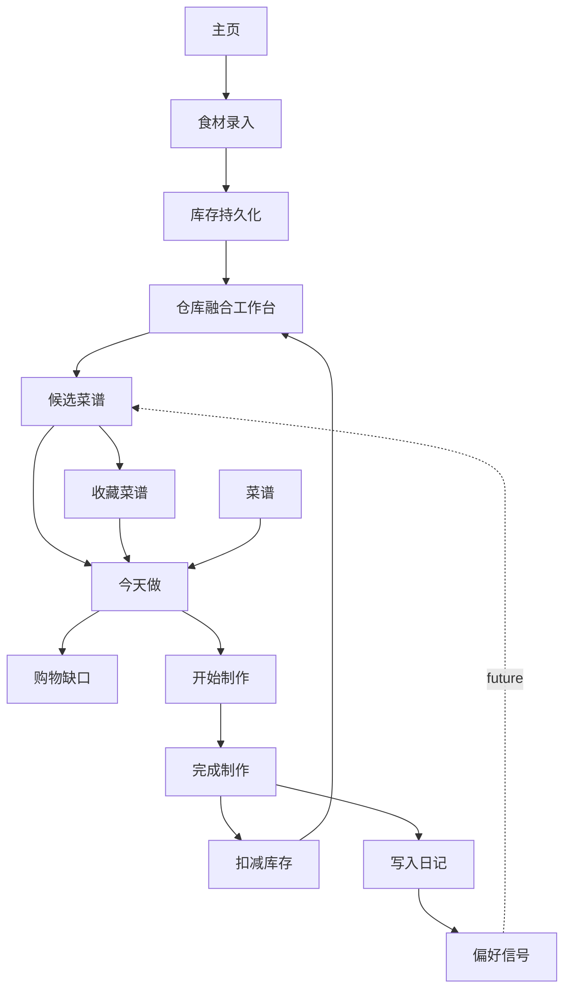
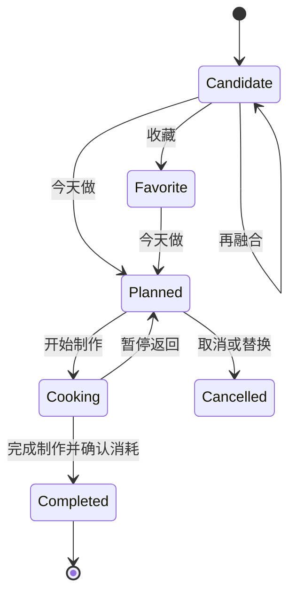
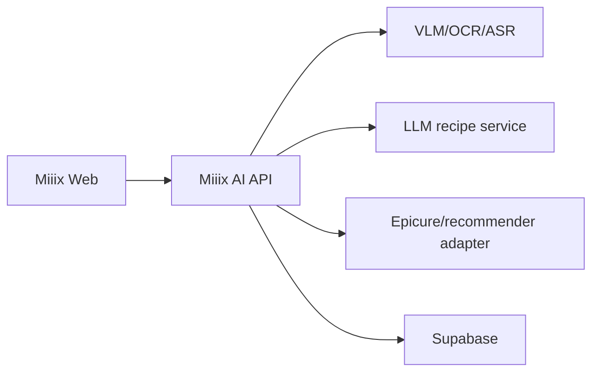

# Miiix 产品需求文档 PRD

文档版本：`PRD v0.4.1`
对应工程版本：`Miiix v0.4.1 持久化纵向链路`
文档状态：Baseline / 后续版本的产品真相源
正式收尾日期：2026-07-17
产品负责人：Hannah
当前交付形态：移动端优先 Web App
当前发布路线：本地验证 -> GitHub Pages -> 云端数据与 AI -> 再评估 iOS

---

## 1. 文档用途

本文档用于固定 Miiix 的产品定义、核心业务链路、页面职责、对象状态、功能边界、数据要求和验收标准。后续会话、设计和开发不得仅依据零散聊天记录推断需求，应优先以本文档和对应版本交接文档为准。

本文档同时承担三项职责：

1. 说明产品最终想解决什么问题。
2. 说明 v0.4.1 已经实现到哪里，以及哪些只是交互原型。
3. 为 v0.4.2 及以后提供稳定边界，防止开发继续横向堆功能。

本文档不是市场宣传材料，也不把尚未接入的模拟能力描述成真实 AI 能力。

---

## 2. 产品一句话定义

> Miiix 是面向有做饭习惯的独居者与小家庭的移动端食材库存和菜谱决策工具：它帮助用户知道家里有什么、现在适合做什么、还缺什么，以及做完后库存发生了什么变化。

产品本质只有两个核心能力：

1. **冰箱与家庭食材库存管理。**
2. **基于真实库存的菜谱生成与做饭闭环。**

“融合器”是产品的创意交互概念，不是扩大产品边界的理由。厨具、口味、菜系、创新菜、识图和语音都必须服务上述两个核心能力。

---

## 3. 产品愿景与阶段目标

### 3.1 长期愿景

让用户在打开冰箱和决定做饭时，不需要依赖记忆、临时搜索和反复纠结；Miiix 能根据真实库存、保鲜状态、现有厨具、个人偏好和可投入时间，给出可信、可执行、可解释的做饭方案。

### 3.2 当前阶段目标

当前不是追求“最聪明的 AI 厨房”，而是验证一个最小闭环是否值得持续使用：

```text
录入食材
-> 看见库存
-> 选择食材、厨具和偏好
-> 得到可执行菜谱
-> 决定今天做
-> 生成缺口清单
-> 完成制作
-> 扣减库存并形成日记
-> 下次推荐使用新的库存状态
```

### 3.3 北极星价值

每一次完成制作，都应同时减少一次决策负担并提高一次库存数据的准确性。

建议的北极星指标在真实埋点上线后定义为：

> 每周完成“基于库存选择菜谱 -> 完成制作 -> 成功扣减库存”的活跃用户数。

---

## 4. 问题定义

### 4.1 用户问题

| 问题 | 用户现状 | 产品机会 |
|---|---|---|
| 不记得家里有什么 | 依赖记忆或临时开冰箱 | 用低成本录入与可视库存建立家庭食材账本 |
| 食材买多后被遗忘 | 不知道采购时间与保鲜状态 | 用批次、日期、储存方式和新鲜度提示优先消耗 |
| 每天不知道吃什么 | 有食材但缺少组合思路 | 基于库存、厨具、偏好和时间给出候选菜 |
| 会做菜但菜式固化 | 按熟悉菜系重复做 | 在可执行边界内提供跨菜系和创新组合 |
| 找到菜谱但缺原料 | 菜谱搜索与库存彼此割裂 | 自动比较菜谱用料与库存并生成缺口清单 |
| 做完后库存仍是旧数据 | 管理与做饭链路断裂 | 完成制作时确认消耗并扣减批次余额 |
| 过去做过什么难以回顾 | 照片、收藏和菜谱分散 | 用日历账本沉淀制作记录和偏好信号 |

### 4.2 现有证据与假设边界

当前主要证据来自创始用户自身使用场景和产品原型反馈，包括：独居、会做饭、常做浙江菜、食材偶尔过量、一个人吃饭容易随便、希望获得杨梅等食材的新做法。

这些信息可以作为**需求假设和早期设计输入**，不能直接等同于市场结论。正式产品判断还需要外部用户验证。

### 4.3 待验证的核心假设

| 编号 | 假设 | 最低验证方式 | 失败信号 |
|---|---|---|---|
| H1 | 用户愿意持续维护一份轻量库存 | 5-10 名目标用户连续使用 2 周 | 第 3 天后停止录入，认为成本高于收益 |
| H2 | 基于库存的推荐比通用菜谱搜索更有价值 | 对比推荐采纳率与普通收藏浏览 | 推荐常因用料不准、不可做而被放弃 |
| H3 | 完成制作后扣库存能形成正反馈 | 观察完成确认率与库存准确度 | 用户频繁跳过确认或修正量过于麻烦 |
| H4 | 厨具和口味偏好能显著提高推荐可执行性 | A/B 比较带约束和不带约束推荐 | 增加选择步骤却未提高采纳率 |
| H5 | 临期优先能减少浪费 | 对比临期食材被使用和被丢弃比例 | 用户无视临期提示或错误率过高 |

---

## 5. 目标用户

### 5.1 核心用户

有稳定或半稳定做饭习惯的独居者与 2-3 人小家庭，符合以下多项特征：

- 每周至少做饭 2 次。
- 会购买生鲜、肉蛋、调料等家庭食材。
- 偶尔忘记库存、买重复或放到过期。
- 搜索菜谱时经常发现缺少材料或厨具。
- 希望提高菜式多样性，但不愿投入很长规划时间。
- 可以接受在识别后做一次快速确认。

### 5.2 次级用户

- 刚开始学习做饭，需要更强步骤指导的人。
- 健身、减脂或有特定口味偏好，需要可控饮食的人。
- 喜欢记录烹饪过程、照片和个人菜谱的人。

### 5.3 当前非目标用户

- 专业餐厅后厨与供应链团队。
- 需要多人复杂权限的大家庭。
- 只点外卖、几乎不储存生鲜的人。
- 需要医疗级营养建议或疾病饮食处方的人。
- 需要精确成本核算、采购审批和财务报表的商业用户。

### 5.4 Jobs To Be Done

1. 当我买完菜回家时，我想快速记下买了什么，以免以后忘记或重复购买。
2. 当我不知道吃什么时，我想直接用家里现有食材获得几道真的能做的菜，而不是继续刷海量菜谱。
3. 当食材快不新鲜时，我想先看到适合消耗它的做法，减少浪费。
4. 当我决定做一道菜时，我想知道缺什么，并得到一份只包含缺口的清单。
5. 当我做完后，我想用很少步骤记录结果并更新库存。
6. 当我再次选择菜时，我希望系统逐渐理解我的口味和实际做饭习惯。

---

## 6. 产品原则

### 6.1 减少决策，不增加维护负担

任何新增字段都必须证明其能改善库存准确性、推荐质量或做饭执行。不能为了数据库完整而要求普通用户填写专业数据。

### 6.2 AI 先提议，用户做最终确认

识别、分类、数量、储存方式、保质期、价格和菜谱都可以由系统预填，但影响库存和制作结果的事实必须可修改、可忽略、可确认。

### 6.3 计划不等于做完

收藏、今天做、开始制作、完成制作是不同承诺等级，不能混为一个按钮或一个状态。

### 6.4 库存以批次和流水为事实

“鸡蛋还有几个”不是单纯修改一个数字。采购、消耗、浪费和人工调整都应留下流水，余额是这些事实的结果。

### 6.5 公共数据由产品维护

食材分类、标准名称、别名、默认储存、营养和公共图片不应由用户承担维护。用户只维护自己的数量、价格、日期、储存位置、备注和纠错。

### 6.6 推荐必须可执行、可解释

推荐理由应说明：使用了哪些现有食材、还缺什么、适配什么厨具和偏好、预计时间与难度。惊喜感不能掩盖可执行性。

### 6.7 不把模拟能力伪装成真实 AI

未接入 OCR、VLM、语音识别或大模型时，界面和文档必须明确为交互原型或演示数据。

---

## 7. 产品范围

### 7.1 MVP 必须覆盖

- 移动端四项主导航：主页、仓库、菜谱、日记。
- 统一食材录入入口。
- 食材人工确认与修改。
- 库存批次、数量、日期、储存和新鲜度。
- 选择库存食材、厨具和偏好进行融合。
- 推荐菜的详情、收藏、再融合、看做法和今天做。
- 今天计划和库存缺口购物清单。
- 完成制作、确认消耗、扣减库存。
- 日历形式的入库和做菜账本。
- 本地持久化与刷新恢复。

### 7.2 后续增强但不是当前阻塞项

- 真实小票 OCR、购物截图识别和食材视觉识别。
- 图片或语音反推菜谱。
- Epicure 或其他推荐模型 Adapter。
- 用户偏好学习和推荐解释评分。
- 菜品照片、AI 评分、贴图和社交分享。
- 云端账号、跨设备同步与家庭协作。
- iOS 原生能力与 App Store 发布。

### 7.3 明确不做

- 餐饮行业库存系统。
- 外卖平台或生鲜电商全链路。
- 医疗营养诊断。
- 复杂社交社区。
- 3D 冰箱作为核心操作界面。
- 为技术先进感而引入 Three.js、ECS 或重型渲染架构。

---

## 8. 信息架构

### 8.1 一级导航

| 导航 | 核心问题 | 页面职责 | 不应承担 |
|---|---|---|---|
| 主页 | 我现在需要关注什么？ | 用户概览、录入入口、库存提醒和当前行动入口 | 完整库存管理和菜谱库 |
| 仓库 | 我可以用什么做什么？ | 库存选择、厨具选择、偏好选择和融合 | 历史日记与复杂设置 |
| 菜谱 | 我保存或做过哪些菜？ | 浏览、筛选、收藏、做过、反推和加入今天 | 直接宣告制作完成 |
| 日记 | 我计划和实际做了什么？ | 今日计划、制作流程、完成确认、日历账本 | 公共菜谱发现 |

### 8.2 页面上下游



---

## 9. 菜谱生命周期

### 9.1 状态定义

| 状态 | 含义 | 用户承诺 | 是否扣库存 | 是否进入日记 |
|---|---|---|---|---|
| Candidate | 刚由融合或反推得到的候选 | 很低 | 否 | 否 |
| Favorite | 用户收藏，未来可能做 | 低 | 否 | 否 |
| Planned | 用户选择今天做 | 中 | 否 | 否 |
| Cooking | 用户已开始看步骤并制作 | 高 | 否 | 否 |
| Completed | 用户确认做完 | 已发生 | 是 | 是 |
| Cancelled | 计划被取消或替换 | 无 | 否 | 否 |

### 9.2 合法转换



禁止的隐式转换：

- 看做法不能直接等于 Cooking 或 Completed。
- 收藏不能自动加入今日计划。
- 加入今日不能自动写日记。
- 打开日记不能自动扣库存。

---

## 10. 核心用户流程

### 10.1 流程 A：录入新食材

1. 用户在主页点击唯一的“添加食材”入口。
2. 页面从下向上进入录入页。
3. 用户选择拍照、购物截图、小票或手动输入。
4. 系统产生一个或多个识别候选；当前原型使用模拟候选。
5. 每个候选显示图片、名称、置信度和处理角标。
6. 用户可选择、忽略、恢复或逐项修正。
7. 系统预填分类、储存方式、保质期、数量模式、默认数量和价格。
8. 用户调整数量、价格、备注和标签。
9. 点击完成后写入库存批次和采购流水。
10. 成功后进入仓库，并能立即看到新库存。

### 10.2 流程 B：融合并决定今天做

1. 用户进入仓库。
2. 在底部组件选择一个或多个库存食材。
3. 横向切换并选择厨具。
4. 横向切换并选择口味、菜系、时间或难度偏好。
5. 点击融合。
6. 页面中央弹出最推荐菜谱卡，使用克制的惊喜动画。
7. 用户可收藏、再融合、看做法或今天做。
8. 点击今天做后创建今日计划和购物缺口，不写日记、不扣库存。
9. 页面进入日记的今日计划区域。

### 10.3 流程 C：完成制作

1. 用户在今日计划点击开始制作。
2. 查看分步教程和所需用料。
3. 完成后点击“完成制作”。
4. 正式版本应展示预计消耗量和库存批次供用户确认；v0.4.1 暂用固定扣减规则。
5. 用户确认后，制作会话、库存消耗、计划完成和日记写入在同一事务完成。
6. 成功后显示消耗和剩余量。
7. 重复点击同一完成操作不得再次扣减。

---

## 11. 功能需求

以下编号是后续验收和 Issue 拆分的稳定引用。

### 11.1 主页 HOME

#### HOME-01 用户信息概览

- 展示用户名。
- 展示基于使用数据计算的等级或身份标签。
- 等级输入至少包括库存维护、做饭频率、完成菜品数量。
- 等级名称应有趣但不能幼稚或干扰核心任务。
- 等级规则必须可解释，不能只随机展示。

验收：同一份用户数据产生稳定标签；阈值变化有明确计算规则。

#### HOME-02 统一录入入口

- 主页只保留一个主要添加入口。
- 具体方式在录入页面内选择。
- 不在主页同时展示四个同级上传按钮。

#### HOME-03 库存关注项

- 展示库存数量、临期项或最近新增的高价值摘要。
- 点击后进入对应库存或仓库上下文。
- 不在主页复制完整库存列表。

### 11.2 录入 INGEST

#### INGEST-01 页面转场

- 进入时从下向上。
- 左上角返回，右上角完成。
- 返回时反向退出，不保存未确认数据。
- 完成后写入成功再跳转仓库。

#### INGEST-02 四种输入方式

- 拍照。
- 线上购物截图。
- 小票。
- 手动输入。

在真实 AI 接入前，前三者必须保留文件选择入口和“演示识别”提示，不能伪装为真实模型结果。

#### INGEST-03 多候选确认

- 多食材结果使用图片网格或横向列表。
- 每项独立显示 selected、ignored 等状态角标。
- 每项可单独编辑，不得只允许编辑第一个结果。
- 完成时只保存未忽略的候选。

#### INGEST-04 三级分类

- 一级示例：肉禽蛋品、水果、蔬菜、豆制品、海鲜水产、粮油调味。
- 二级示例：猪肉、牛肉、鸡肉。
- 三级示例：鸡翅、鸡爪、鸡胸肉、鸡腿肉。
- 一级和二级用单行可横向滑动标签。
- 三级用 3-5 行图片项，显示真实食材图和名称。
- 分类来源必须由产品公共目录维护。

#### INGEST-05 食材字段

每个确认项至少包含：

- 标准食材。
- 用户看到的名称。
- 分类路径。
- 推荐储存区域与储存标签。
- 建议保质期与预计到期时间。
- 数量模式：件数或克重二选一。
- 数量或克重。
- 价格。
- 采购日期。
- 备注。
- 自定义标签。
- 识别来源和用户是否纠错。

#### INGEST-06 默认值

- 分类、储存、保质期、数量模式、默认数量和参考价格由标准食材预填。
- 用户修改后以用户确认值写入其库存。
- 参考价格必须标记数据日期和地区，不应长期硬编码为“全国平均价”却无来源。

### 11.3 仓库与融合 WAREHOUSE

#### WAREHOUSE-01 移动端固定工作台

- 页面不得超过移动端应用宽度。
- 主要融合画布约占可用区域三分之二并保留明显留白。
- 底部选择组件与四项底部导航左右对齐并贴合。
- 页面主体不依赖整页下拉完成融合。
- 某一类别内容过多时，仅该行局部横向滑动。

#### WAREHOUSE-02 食材选择

- 只显示当前可用且余额大于零的库存批次投影。
- 图片、名称和新鲜度匹配同一食材。
- 选中状态清晰可见。
- 支持一个或多个食材。
- 后续应优先呈现临期食材，但不能强制选择。

#### WAREHOUSE-03 厨具选择

- 使用厨具真实产品感图片或统一风格抠图，不仅用图标和文字。
- 图片与名称必须正确匹配。
- 至少覆盖炒锅、蒸锅、烤箱、电磁炉、榨汁机、豆浆机、咖啡机。
- 采用低饱和度、复古、线条简洁的资产风格。

#### WAREHOUSE-04 偏好选择

- 偏好可以表达口味、菜系、时间、难度或热量方向。
- MVP 可先使用预设组合。
- 选择结果必须进入推荐输入快照，不能只是视觉状态。

#### WAREHOUSE-05 融合

- 未选择食材时融合按钮禁用。
- 点击后生成候选结果。
- 候选必须说明使用食材、缺少食材、厨具、偏好匹配、时间、难度和推荐理由。
- 当前确定性逻辑必须标记为原型；真实模型接入后保存模型和 Prompt 版本。

#### WAREHOUSE-06 推荐弹窗

- 在整个页面中央显示，不限制在融合画布内部。
- 遮罩和卡片均不超出移动端视口。
- 正反面内容过长时卡片内部滚动，底部主操作始终可见。
- 正面包含菜名、菜图、时间、难度、主料、调味、菜系、卡路里和理由。
- 操作包含收藏、再融合、看做法、今天做。
- 看做法使用卡片翻转，展示步骤而不改变业务状态。

### 11.4 菜谱 RECIPES

#### RECIPES-01 列表与筛选

- 第一行筛选：全部、收藏、做过。
- 第二行预留菜系、时间、难度等条件。
- 卡片至少展示图片、菜名、需要食材、时间、难度、菜系和卡路里。
- 收藏和做过来自真实持久化状态，不由静态标签假装。

#### RECIPES-02 菜谱详情

- 结构化主料与调味料。
- 数量、单位、可选性和替代建议。
- 厨具。
- 按顺序的步骤、预计时间和关键提醒。
- 来源、授权和生成方式。
- 营养为估算值时必须明确标注。

#### RECIPES-03 反推做法入口

- 支持菜品照片。
- 支持语音或文字描述菜名、口感和口味。
- 输出应包含识别置信度、推断线索、可能菜名、风味和步骤。
- 结果默认是候选，不直接进入用户正式菜谱或日记。
- 真实 VLM/ASR 未接入前必须明确为原型。

#### RECIPES-04 收藏与今天做

- 收藏保存完整菜谱，不只保存 ID 或按钮状态。
- 今天做进入 Planned 状态。
- 做过状态只能由 Completed 制作会话产生。

### 11.5 计划与购物 PLAN

#### PLAN-01 今日计划

- 同一天默认只保留一个主要未完成计划；新计划可替换或取消旧计划。
- 保存来源：融合、收藏、菜谱或反推。
- 保存选中的库存批次。
- 显示状态和计划日期。

#### PLAN-02 购物缺口

- 用菜谱结构化需求减去可用库存量。
- 仅输出缺口，不重复列出库存已覆盖内容。
- 必须考虑数量和单位换算；v0.4.1 仅按名称判断属于已知缺陷。
- 用户可勾选已买、重新录入库存或移除条目。

### 11.6 制作与日记 DIARY

#### DIARY-01 今日制作卡

- 展示今天计划的菜、来源、步骤和所需食材。
- 支持开始制作、展开步骤、暂停返回和完成制作。
- 完成前显示预计消耗并允许纠正。

#### DIARY-02 完成制作

- 一次原子操作完成制作会话、库存消耗、计划状态和日记记录。
- 同一计划重复提交只能产生一次有效扣减。
- 失败时不得出现部分完成。
- 成功后显示本次扣减和剩余量。

#### DIARY-03 日历账本

- 参考银行卡收支账本结构。
- 入库为“收入”，做菜消耗为“支出”。
- 月历日期显示当天入库和做菜数量摘要。
- 点击日期展示具体食材、菜品、时间和消耗。
- 入库与制作必须来自真实流水，不能由页面静态拼接。

#### DIARY-04 制作反馈

后续能力：

- 上传成品照片。
- 用户评分和口味反馈。
- AI 外观建议必须标注为娱乐或辅助，不替代食品安全判断。
- 保存为个人菜谱或制作贴图。
- 反馈成为偏好学习信号。

---

## 12. 数据模型要求

### 12.1 公共食材主数据

| 字段组 | 必要信息 |
|---|---|
| 身份 | 稳定 ID、标准中文名、英文名、学名或外部标识 |
| 分类 | 一级、二级、三级分类及排序 |
| 别名 | 口语、地区名、零售名、OCR 常见写法、模型 token |
| 储存 | 默认区域、环境标签、不同方式的建议保质期 |
| 单位 | 默认模式、默认份量、支持单位和换算 |
| 营养 | 每 100g 热量和可追溯来源 |
| 价格 | 地区、日期、单位和来源，不混同用户实付价格 |
| 图片 | 主图、抠图、来源、授权、审核状态、风格标签 |
| 治理 | 数据版本、创建人、审核人、更新时间、来源证据 |

### 12.2 用户库存批次

每次采购独立记录：

- 用户 ID。
- 标准食材 ID。
- 展示名称。
- 初始数量和当前余额。
- 单位 ID。
- 采购日期和录入时间。
- 预计到期时间。
- 实际储存方式。
- 实付价格。
- 来源：拍照、截图、小票、手动或迁移。
- 备注和自定义标签。
- 状态：可用、耗尽、浪费、删除或归档。

### 12.3 库存流水

- `purchase`：采购入库。
- `consume`：制作消耗。
- `waste`：丢弃或变质。
- `adjust`：盘点修正。

每条流水必须包含批次、数量、单位、时间、原因、来源对象和幂等键。

### 12.4 菜谱

- 稳定菜谱 ID 和版本。
- 标题、菜系、难度、时间、份数和热量估算。
- 主图及授权。
- 结构化用料：食材 ID、数量、单位、角色、是否可选、替代项。
- 分步教程。
- 所需厨具。
- 来源：编辑、模型生成、图片反推、用户创建。
- 模型、Prompt 和数据版本。

### 12.5 推荐运行

每次推荐至少保存：

- 输入库存批次快照。
- 厨具和偏好。
- 候选列表。
- 每个候选的库存覆盖、临期利用、偏好、难度和创新分数。
- 模型和规则版本。
- 用户行为：查看、收藏、再融合、计划、完成或拒绝。

---

## 13. 食材主数据治理

### 13.1 谁维护什么

| 数据 | 维护主体 |
|---|---|
| 标准名称、分类、别名、默认储存、营养、公共图片 | Miiix 产品数据团队或可信数据源 |
| 用户购买数量、日期、价格、储存位置和备注 | 用户确认 |
| AI 识别候选 | 模型生成，用户审核 |
| 用户纠错 | 用户产生，系统记录为反馈 |
| 菜谱结构化用料 | 产品编辑、可信来源或模型生成后审核 |

结论：用户不需要自己维护公共食材数据库。

### 13.2 v0.4.2 建设策略

1. 先定义高频食材入选标准。
2. 设计可机器验证的 JSON Schema。
3. 完成 30 个黄金样本。
4. 验证分类、别名、储存、单位、图片和导入查询。
5. 再扩展到首批 200 个。
6. 建立人工抽检和版本变更记录。

### 13.3 图片验收

- 真实食物照片，不用低质量插画替代。
- 主体清晰、构图简洁、接近优质美食内容风格。
- 去除原背景，保留透明背景。
- 可加细描边避免与浅色页面融合。
- 同类别的拍摄角度、光线和比例尽量一致。
- 图片与食材、厨具名称严格匹配。
- 保存来源、授权、下载时间和处理记录。
- 未确认商用授权的图片不得作为正式发布资产。

---

## 14. AI 与多模态能力边界

### 14.1 能力分层

| 能力 | 输入 | 输出 | 当前状态 |
|---|---|---|---|
| 食材识别 | 食材照片 | 食材候选、数量线索、置信度 | 模拟 |
| 小票 OCR | 小票图片 | 商品行、数量、价格 | 模拟 |
| 购物截图理解 | 电商截图 | 商品、规格、价格 | 模拟 |
| 菜品反推 | 菜图或口味描述 | 可能菜名、线索、步骤 | 模拟 |
| 库存菜谱推荐 | 库存、厨具、偏好 | 排序候选、理由、缺口 | 确定性原型 |
| 偏好学习 | 收藏、计划、完成、评分 | 用户偏好画像 | 未实现 |

### 14.2 推荐的服务边界

浏览器不能直接保存模型密钥。真实 AI 应通过服务端 API 或受控 Edge Function 调用：



MCP 可以作为研发工具或模型编排接口，但不应直接充当面向普通用户的公开后端。正式产品需要鉴权、限流、成本控制、日志、超时、重试和隐私策略。

### 14.3 人工确认原则

- 低置信度结果必须突出展示。
- 多候选不得静默选择。
- 数量和价格无法可靠识别时应留空或给出弱默认，不可伪造精确值。
- 食品安全、过敏原和保质期不得仅依赖大模型自由生成。
- 用户纠错应记录原始值、修改值、模型版本和时间。

---

## 15. 推荐策略

### 15.1 候选硬约束

- 用户现有厨具可完成。
- 关键主料有库存或缺口明确。
- 不违反用户明确排除的过敏和禁忌。
- 时间和难度不超过用户当前选择。

### 15.2 排序信号

建议首版可解释评分：

```text
总分 = 库存覆盖 35%
     + 临期利用 20%
     + 偏好匹配 20%
     + 厨具匹配 10%
     + 时间与难度匹配 10%
     + 探索新颖度 5%
```

该权重是待验证产品假设，不是最终算法。每次推荐应保存分项证据，以便分析用户为什么采纳或拒绝。

### 15.3 探索与熟悉平衡

- 默认优先可做和少缺口。
- 允许提供一项“试点新口味”的探索候选。
- 不因为追求创新而推荐明显不合理的食材组合。
- 对浙江等地域口味可建立偏好，但不把单个用户习惯硬编码为所有用户默认。

---

## 16. 指标体系

### 16.1 激活

- 首次会话成功添加至少 3 个食材。
- 首次会话完成一次融合。
- 首次会话查看一个推荐详情。

### 16.2 核心漏斗

```text
添加库存
-> 发起融合
-> 查看候选
-> 收藏或今天做
-> 开始制作
-> 完成制作
-> 确认库存扣减
```

建议观测：

- 库存录入完成率。
- 融合发起率。
- 推荐查看到“今天做”的转化率。
- 计划到完成制作的转化率。
- 完成制作后的扣减确认率。
- 推荐后仍需要额外搜索菜谱的比例。

### 16.3 留存和质量

- 次周仍维护库存的用户比例。
- 每周完成制作次数。
- 识别后人工修改率。
- 库存盘点时的数量误差。
- 临期食材成功消耗率。
- 重复购买和浪费自报变化。
- 推荐采纳率与拒绝理由。

### 16.4 护栏指标

- 错误扣减率。
- 识别错误导致的错误库存率。
- 数据丢失和同步冲突率。
- 推荐包含明确禁忌食材的比例。
- AI 请求失败率、平均时延和单次成本。

### 16.5 事件命名建议

- `inventory_ingest_started`
- `recognition_candidate_corrected`
- `inventory_lot_created`
- `fusion_requested`
- `recommendation_viewed`
- `recipe_favorited`
- `meal_plan_created`
- `cooking_started`
- `cooking_completed`
- `inventory_consumption_confirmed`
- `shopping_item_checked`
- `recipe_feedback_submitted`

事件必须包含版本、来源页面、对象 ID 和时间；不得上传原始照片或语音到分析系统。

---

## 17. 非功能需求

### 17.1 移动端适配

- 以 390 x 844 作为核心验收视口。
- 页面内容宽度不得超过视口。
- 底部导航支持安全区。
- 触控目标建议至少 44 x 44px。
- 局部横向滑动不得导致整页横向溢出。
- 弹窗正反面均应完整显示关键操作。

### 17.2 性能

- 首屏静态资源应持续监测，不因图片库直接打包而无限增长。
- 图片应使用合理尺寸、压缩、缓存和懒加载。
- 普通库存查询在本地应接近即时反馈。
- AI 任务应有加载、取消、超时和失败重试状态。
- 当前没有证据需要 Three.js 或高性能游戏渲染架构。

### 17.3 可靠性

- 制作完成与扣减库存必须原子化。
- 重复请求必须幂等。
- 刷新后恢复用户事实。
- Schema 和本地数据库升级必须可测试。
- 云端接入后需要离线队列、同步状态和冲突策略。

### 17.4 可访问性

- 图片有准确 alt 文本。
- 状态不只依赖颜色表达。
- 文字和背景满足基本对比度。
- 支持系统减少动态效果设置。
- 键盘和屏幕阅读器能够完成主要 Web 流程。

### 17.5 隐私与安全

- 食材照片、小票和购物截图可能包含地址、订单号和支付信息。
- 上传前后应最小化采集，定义保留期限和删除机制。
- 模型密钥不得出现在前端代码。
- 用户私人库存和日记默认私有。
- 云端使用 Supabase 时启用 Auth 和 RLS，并测试越权访问。

---

## 18. 通用交互状态

每个关键页面或动作必须考虑：

| 状态 | 最低要求 |
|---|---|
| Empty | 告诉用户下一步可执行动作，不展示假数据冒充内容 |
| Loading | 显示正在处理的具体阶段，避免无反馈 |
| Partial | 多食材中某项失败时允许继续处理其他项 |
| Error | 保留用户输入，说明可重试或手动完成 |
| Offline | 本地操作可继续时明确提示，云能力不可用时降级 |
| Success | 明确写入了什么、下一步在哪里 |
| Conflict | 云端接入后让用户理解哪个版本被保留 |
| Permission denied | 相机、相册、麦克风拒绝后提供设置和替代入口 |

---

## 19. v0.4.1 实现状态

| 模块 | 状态 | 当前事实 | 主要缺口 |
|---|---|---|---|
| 四项导航 | 已实现 | 主页、仓库、菜谱、日记可用 | 真实用户可用性验证 |
| 统一录入 | 交互原型 + 本地写入 | 可选四种方式并保存库存 | OCR/VLM 仍为模拟，多候选数据有限 |
| 库存持久化 | 已实现 | IndexedDB 批次和采购流水 | 重置、导出、升级恢复 |
| 融合工作台 | 已实现原型 | 食材、厨具、偏好和弹窗链路可用 | 推荐不是模型，解释证据有限 |
| 收藏 | 已实现 | 可持久化完整菜谱 | 数据目录仍小 |
| 今日计划 | 已实现 | 计划与购物清单持久化 | 缺口只按名称，不比较数量 |
| 制作完成 | 已实现闭环 | 原子扣减、幂等、日记持久化 | 扣减量仍为临时固定规则 |
| 日历账本 | 已实现投影 | 入库和制作记录可查看 | 还没有照片、评分和高级统计 |
| 食材主数据 | 未达标 | 仅小型本地演示目录 | 首批 200 食材和资产治理 |
| Supabase | 仅目标 Schema | 5 个 Migration 和合同 | 项目、Auth、Adapter、同步未接入 |
| AI 识别 | 未实现 | 只有文件入口和模拟候选 | 后端、模型、评测、成本与隐私 |
| AI 推荐 | 未实现 | 确定性前端组合 | 推荐 Adapter、候选库和离线评测 |
| GitHub Pages | 未完成 | 构建可通过 | 部署配置、base path 和验证 |
| iOS | 暂停 | Capacitor 壳保留 | 不进入当前路线 |

---

## 20. v0.4.1 发布验收

本版本只有同时满足以下条件才能关闭：

- [x] 新增库存写入批次与采购流水。
- [x] 刷新后库存恢复。
- [x] 生成或保存菜谱后可创建今日计划。
- [x] 今日计划与购物清单刷新后恢复。
- [x] 完成制作写入制作会话。
- [x] 完成制作扣减选中库存批次。
- [x] 制作、扣减、计划完成和日记原子提交。
- [x] 重复完成同一计划不会二次扣减。
- [x] 本地业务日期在中国时区正确。
- [x] 390px 视口无横向溢出。
- [x] 自动化测试、生产构建和迁移检查通过。
- [x] 交接文档、PRD 和新会话 Prompt 完成。
- [ ] Git commit 与 push 成功后补足最终版本关闭事实。

---

## 21. 版本路线

### v0.4.2 食材主数据

唯一主目标：建立可审核、可导入、可查询的食材标准目录。

- 先完成 30 个黄金样本。
- 再扩展到 200 个高频食材。
- 建立别名、分类、储存、单位、营养和图片授权。
- 建立 JSON Schema、导入脚本和数据质量测试。

### v0.4.3 可部署 Web

- 配置 GitHub Pages。
- 处理 Vite base path、前端路由和资源路径。
- 提供本地数据重置、导出和导入。
- 增加核心 E2E 测试。
- 用少量目标用户进行连续使用验证。

### v0.5.0 云端账户与同步

- Supabase 项目、Auth、RLS 验收。
- Supabase Repository Adapter。
- 本地优先同步、冲突和迁移策略。
- 服务端 AI API 的安全边界。

### v0.6.0 真实识别与推荐实验

- 先接一种高价值输入，例如小票 OCR，不同时铺开三种模型。
- 建立标注集、准确率、纠错率、延迟和成本基线。
- 再接库存推荐和 Epicure 映射实验。

iOS 何时恢复：Web 闭环获得连续用户使用证据、云端数据和 AI 服务边界稳定后再决定。

---

## 22. 开放问题与决策纪律

### 已决定，不重复讨论

- 产品本质是库存管理与菜谱生成。
- 当前前端继续使用 React + TypeScript + Vite。
- GitHub Pages 优先于 iOS。
- 验证期使用 IndexedDB，目标云端为 Supabase PostgreSQL。
- 业务服务依赖 Repository 抽象。
- 不使用 ECS、Three.js 或 PocketJS 重写当前产品。
- 用户不维护公共食材主数据。

### 需要用证据决定

- 库存录入的最小字段到底是多少。
- 用户更愿意使用拍照、小票还是购物截图。
- 临期提示采用百分比、天数还是行为文案。
- 一次推荐展示 1 个惊喜结果还是 3 个可比较候选。
- 计划替换旧菜时的确认方式。
- 制作完成时用户愿意确认多细的消耗量。
- 账号与跨设备同步何时成为留存前提。

这些问题不得在没有用户数据时凭个人偏好永久定死。每项应记录假设、实验、结果和版本决策。

---

## 23. 产品变更流程

任何影响产品边界、核心链路或数据状态的变更必须完成：

1. 写明用户问题与证据等级。
2. 判断是否属于当前版本目标。
3. 更新本 PRD 对应章节或新增版本附录。
4. 明确页面上游、下游和状态转换。
5. 明确新增或修改的数据对象。
6. 明确异常、空状态和回滚策略。
7. 实现自动化测试和移动端验证。
8. 更新代码仓库版本记录和 Obsidian 版本笔记。

没有完成上述步骤的视觉或功能想法，只能进入待评估列表，不能直接插入开发。

---

## 24. 相关文档

- [`v0.4.1 项目交接`](../handoff/v0.4.1-project-handoff.md)
- [`v0.4.2 新会话启动 Prompt`](../handoff/v0.4.2-session-prompt.md)
- [`版本总账`](../../outputs/version-history.md)
- [`数据库说明`](../../database/README.md)
- [`Repository 说明`](../../src/data/repositories/README.md)

本文档基线状态：**v0.4.1 产品范围已冻结，下一会话只能从 v0.4.2 的单一目标开始。**
