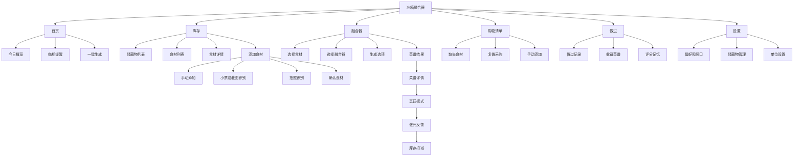
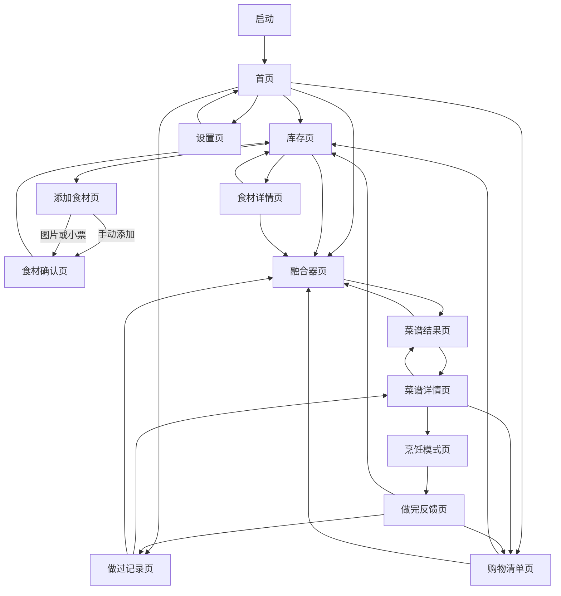
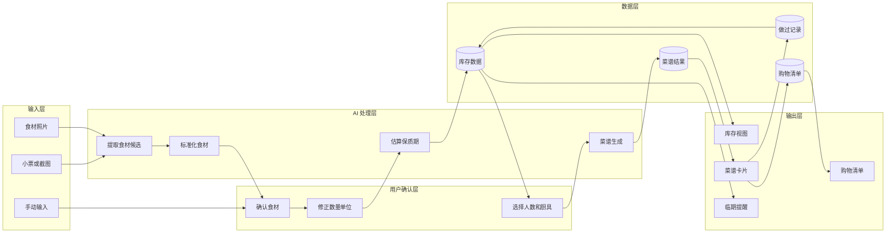
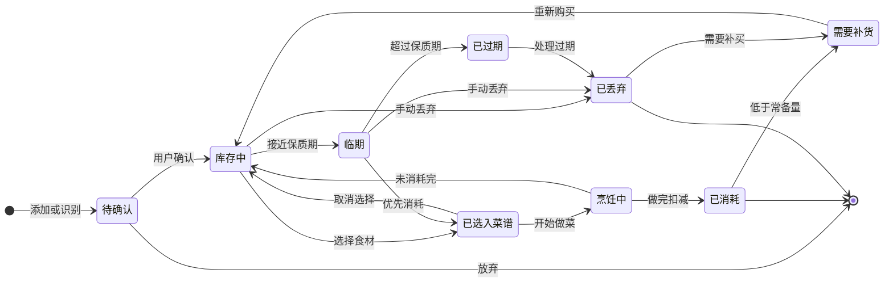

# 冰箱融合器 MVP Flow

日期：2026-06-26

## 1. 结论

现在需要做流程图，但只做 MVP 级别，不做完整大而全产品地图。

原因：

- 这个产品有库存、菜谱、购物清单、历史记录几个对象，如果不先画上下游，页面会很快散掉。
- 核心价值来自闭环：录入库存 -> 生成菜谱 -> 做完扣库存 -> 形成购物清单。
- 现阶段不需要复杂用户旅程地图，也不需要完整服务架构图。

本文件包含 5 类图：

- 信息架构图，英文常叫 Information Architecture 或 Sitemap。
- 用户主流程图，英文常叫 User Flow 或 Task Flow。
- 页面流程图，英文常叫 Screen Flow 或 Page Flow；如果带页面线框，也叫 Wireflow。
- 产品业务逻辑图，英文可叫 Product Logic Flow 或 Business Flow。
- 库存状态流转图，英文常叫 State Diagram。

## 2. 当前范围

MVP 主线：

> 冰箱库存管理 + 基于库存生成菜谱 + 做完后更新库存/购物清单。

MVP 暂不画入主链路：

- 真实电商下单。
- 家庭成员协作。
- 复杂营养分析。
- 智能冰箱硬件连接。
- 完整 RAG 知识库。

## 3. 信息架构图 IA / Sitemap

## 4. 用户主流程图 User Flow / Task Flow

```mermaid
flowchart LR
    start([开始])
    openApp["打开应用"]
    hasInventory{有可用库存?}
    addStock["添加食材"]
    confirmStock["确认库存"]
    viewInventory["查看库存"]
    selectIngredients["选择食材"]
    chooseMixer["选择融合器"]
    generateRecipes["生成菜谱"]
    viewRecipes["查看菜谱结果"]
    chooseRecipe{决定做哪道?}
    cookRecipe["进入烹饪"]
    finishCooking["标记做完"]
    updateInventory["扣减库存"]
    createShoppingList["生成购物清单"]
    saveRecord["保存做过记录"]
    finish([完成闭环])

    start --> openApp
    openApp --> hasInventory
    hasInventory -->|"否"| addStock
    addStock --> confirmStock
    confirmStock --> viewInventory
    hasInventory -->|"是"| viewInventory
    viewInventory --> selectIngredients
    selectIngredients --> chooseMixer
    chooseMixer --> generateRecipes
    generateRecipes --> viewRecipes
    viewRecipes --> chooseRecipe
    chooseRecipe -->|"继续挑"| selectIngredients
    chooseRecipe -->|"开始做"| cookRecipe
    cookRecipe --> finishCooking
    finishCooking --> updateInventory
    updateInventory --> createShoppingList
    updateInventory --> saveRecord
    createShoppingList --> finish
    saveRecord --> finish
```

## 5. 页面流程图 Screen Flow / Page Flow

## 6. 产品业务逻辑图 Product Logic Flow

## 7. 库存状态流转图 State Diagram

## 8. 页面职责表

| 页面 | 核心职责 | 上游入口 | 下游去向 | MVP 必须程度 |
|---|---|---|---|---|
| 首页 | 看库存概览、临期提醒、快速生成 | 启动应用 | 库存页、融合器页、购物清单 | 必须 |
| 库存页 | 管理所有食材和储藏位置 | 首页、反馈页 | 添加食材、食材详情、融合器 | 必须 |
| 添加食材页 | 新增库存 | 库存页、首页快捷入口 | 食材确认页、库存页 | 必须 |
| 食材确认页 | 修正识别结果和数量 | 添加食材页 | 库存页 | 必须 |
| 食材详情页 | 查看和编辑单个库存条目 | 库存页 | 库存页、融合器页 | 可简化 |
| 融合器页 | 选择食材和厨具 | 首页、库存页、食材详情 | 菜谱结果页 | 必须 |
| 菜谱结果页 | 展示 3 个候选菜谱 | 融合器页 | 菜谱详情页、融合器页 | 必须 |
| 菜谱详情页 | 展示步骤、缺失食材、库存消耗 | 菜谱结果页、历史记录页 | 烹饪模式、购物清单 | 必须 |
| 烹饪模式页 | 跟做菜谱 | 菜谱详情页 | 做完反馈页 | 可简化 |
| 做完反馈页 | 评分、收藏、扣减库存 | 烹饪模式页 | 库存页、做过记录、购物清单 | 必须 |
| 购物清单页 | 管理缺失和补货食材 | 首页、菜谱详情、反馈页 | 库存页、融合器页 | 必须 |
| 做过记录页 | 查看历史和复做 | 首页、反馈页 | 菜谱详情、融合器页 | 第二优先级 |
| 设置页 | 管理偏好、忌口、储藏物 | 首页 | 首页 | 第二优先级 |

## 9. MVP 导航建议

底部 Tab 保留 4 个：

- 首页
- 库存
- 融合器
- 购物清单

第二层入口：

- 做过记录放在首页或个人入口，不进底部 Tab。
- 设置放在右上角，不进底部 Tab。
- 添加食材作为库存页主按钮，也可以在首页放快捷按钮。

## 10. 严格范围判断

第一版必须完整：

- 添加食材。
- 查看库存。
- 选择库存食材。
- 生成菜谱。
- 标记做完。
- 扣减库存。
- 生成购物清单。

第一版可以模拟：

- 图片识别。
- 小票识别。
- AI 菜谱生成。

第一版不要做：

- 完整账号系统。
- 复杂家庭协作。
- 真实电商下单。
- 智能冰箱硬件连接。

## 11. 下一步产物

基于本 Flow，下一步应该产出低保真页面说明：

- 每个页面的主按钮。
- 空状态文案。
- 关键字段。
- 页面组件优先级。

这一步完成后再进入视觉设计或前端开发。
