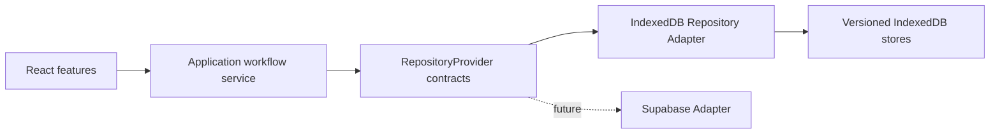

# v0.4.1 Repository Adapter Self-check

Date: 2026-07-17

## Goal

Make the complete product path durable:

`add inventory -> select inventory -> save today's recipe -> complete cooking -> deduct inventory -> write diary -> reload`

## Architecture

The UI chooses actions. `kitchenPersistence.ts` coordinates business steps. Repository contracts define the available data operations. The IndexedDB Adapter translates those operations into browser database reads and writes.

## Repository Adapter Definition

- **Repository** is the stable business-facing interface. It says what can be done without exposing database details.
- **Adapter** is a replaceable implementation of that interface for one technology.
- **Provider** assembles all repositories and supplies one transaction boundary.

This matters because React screens no longer need to know object-store names, indexes, Supabase table names, SQL, retries, or balance-update rules. Replacing IndexedDB with Supabase changes the adapter, not the product workflow.

## Implemented Controls

- Inventory creation writes a lot and its purchase ledger record together.
- Cooking completion, inventory deduction, diary metadata, and plan completion share one atomic transaction.
- A negative inventory balance is rejected.
- Cooking and inventory transactions use idempotency keys.
- Refresh restores inventory, generated recipes, favorites, today's plan, shopping list, cooked IDs, and diary.
- Cooking entries retain the user's local business date instead of truncating the UTC timestamp.
- Versioned local demo seed data initializes only once.

## Verification Evidence

- `pnpm run test`: passed, 1 vertical integration test.
- `pnpm run build`: passed, 1,598 modules transformed.
- `pnpm run check:migrations`: passed, 5 ordered migrations.
- `git diff --check`: passed.
- Browser validation at 390 x 844: passed.
- Browser console errors: none.
- Manual browser result: chicken-wing inventory changed from 500g to 375g after cooking, and the result survived reload.
- Retry verification: one cooking completion produced exactly one consume transaction.

## Remaining Boundaries

- IndexedDB data belongs to one browser on one device; it is not account-backed or synchronized.
- The canonical food catalog is still a small local seed, not the reviewed 200-item target catalog.
- Recognition and recommendation repositories exist, but the UI still uses mock recognition and deterministic recipe fusion.
- Supabase deployment, authentication, storage, and cloud adapter remain unimplemented.

## Next Quality Gate

v0.4.2 should focus on the reviewed ingredient data foundation: taxonomy, aliases, storage guidance, units, nutrition provenance, and licensed image assets. Do not expand AI features until the data they consume is trustworthy.
